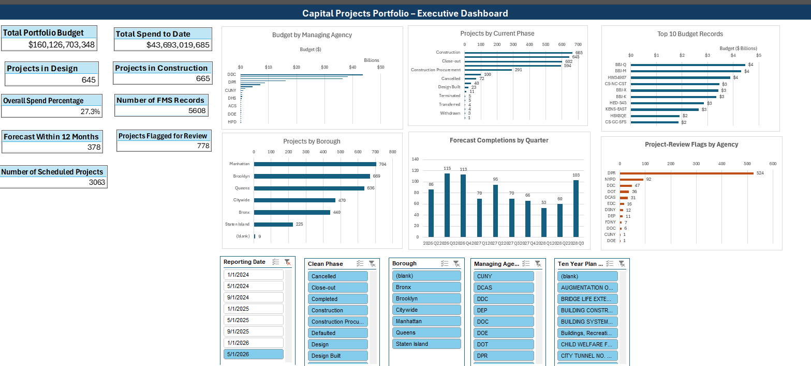

# Capital Projects Portfolio – Executive Dashboard

An interactive Excel dashboard developed to analyze capital project budgets, spending, project phases, forecast completions, geographic distribution, and projects requiring review.

## Dashboard Preview

## Project Overview

This project transforms capital-project data into a one-page executive dashboard in Microsoft Excel. PivotTables, Power Pivot measures, PivotCharts, helper columns, and slicers allow users to examine portfolio performance across reporting periods, agencies, phases, boroughs, and ten-year plan categories.

## Key Performance Indicators

- Total Portfolio Budget
- Total Spend to Date
- Overall Spend Percentage
- Number of FMS Records
- Number of Scheduled Projects
- Projects in Design
- Projects in Construction
- Forecast Completions Within 12 Months
- Projects Flagged for Review

## Dashboard Visuals

- Projects by Current Phase
- Budget by Managing Agency
- Projects by Borough
- Forecast Completions by Quarter
- Top 10 Budget Records
- Project-Review Flags by Agency

## Interactive Filters

- Reporting Date
- Managing Agency
- Clean Phase
- Borough
- Ten Year Plan Category

## Tools and Techniques

- Microsoft Excel
- PivotTables and PivotCharts
- Power Pivot and DAX measures
- Data Model
- Excel Tables
- Slicers
- Data cleaning and helper columns
- Distinct-count calculations

## Download the Dashboard

[Download the interactive Excel dashboard](Capital%20Projects%20Executive%20Dashboard.xlsx)

> Download and open the workbook in the desktop version of Microsoft Excel for full slicer and Data Model functionality.

## Key Skills Demonstrated

- Portfolio performance analysis
- Budget and spending analysis
- KPI development
- Dashboard design
- Data cleaning
- Data visualization
- Executive reporting
